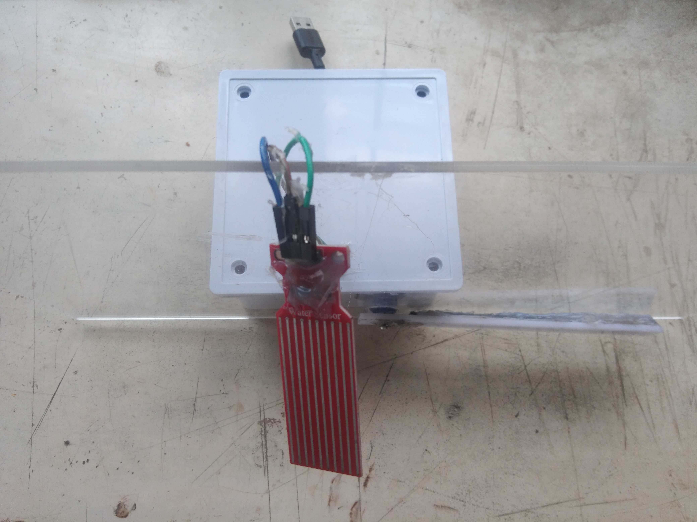

# Automatic Rain-Sensing Windshield Wiper

An Arduino-based windshield wiper that turns itself on when it detects rain and
speeds up as the rain gets heavier. A resistive water sensor reads how wet the
glass is, and a servo sweeps the wiper arm across a clear acrylic "windshield."



## How it works

- **Dry:** the wiper stays parked at 0°.
- **Rain detected:** the servo sweeps the arm back and forth, 0° ↔ 180°.
- **Heavier rain:** the sweep gets faster (shorter delay per step).
- The sensor is re-read every step, so the wiper parks the instant rain stops.

## Hardware

| Part | Connects to |
|------|-------------|
| Arduino Uno / Nano | USB power |
| Analog rain / water sensor module | signal → `A0`, `+5V`, `GND` |
| Hobby servo (SG90 / MG90, etc.) | signal → `D9`, `+5V`, `GND` |
| Clear acrylic sheet + wiper arm | mounted on the servo horn |

Pin assignments live as named constants at the top of
[wiper_code/wiper_code.ino](wiper_code/wiper_code.ino) — change `SENSOR_PIN` and
`SERVO_PIN` to match your wiring.

## Upload

1. Open `wiper_code/wiper_code.ino` in the Arduino IDE.
2. Select your board and port.
3. Upload.

## Calibrate

1. Open the Serial Monitor at **9600 baud**.
2. Note the `Rain:` value when the sensor is dry, then again when wet.
3. Set `RAIN_THRESHOLD` a little above the dry reading.

> Polarity note: this sensor reads **higher** when wetter. If yours reads lower
> when wet, flip the comparison in `loop()` and swap `WIPE_DELAY_MIN`/`MAX`.

## In action

Serial Monitor while the wiper sweeps: the arm steps `177 → 180°`, reports
`Wiper= ON`, then reverses (`TURNING OFF`).


> This capture is from an earlier build of the firmware, so the log wording
> differs from the current sketch (which prints `Rain: … | Wiping at … ms/deg`).

## Repo layout

```
08-Wiper/
├── README.md
├── .gitignore
├── wiper_code/
│   └── wiper_code.ino      # the wiper firmware
├── IMG_*.jpg               # build photos
└── Screenshot *.png        # Serial Monitor captures
```
